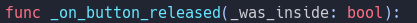

# Integrating the TouchScreenButton Node into Godot Editor

To seamlessly integrate the new TouchScreenButton node into your Godot editor, simply follow these straightforward steps:

### 1. Add Source Files
- Copy the `.cpp` and `.h` files of the TouchScreenButton node from `src` folder to the `\scene\2d` directory within your project.
- If needed overwrite changes.

Following these steps will seamlessly integrate the TouchScreenButton node into your Godot editor environment, enabling smooth usage and enhanced functionality.

That's it! You're now ready to utilize the TextLabel node within your Godot projects. Happy coding! 🚀

Now you have an option to know when button is released if it was inside button area or not!
